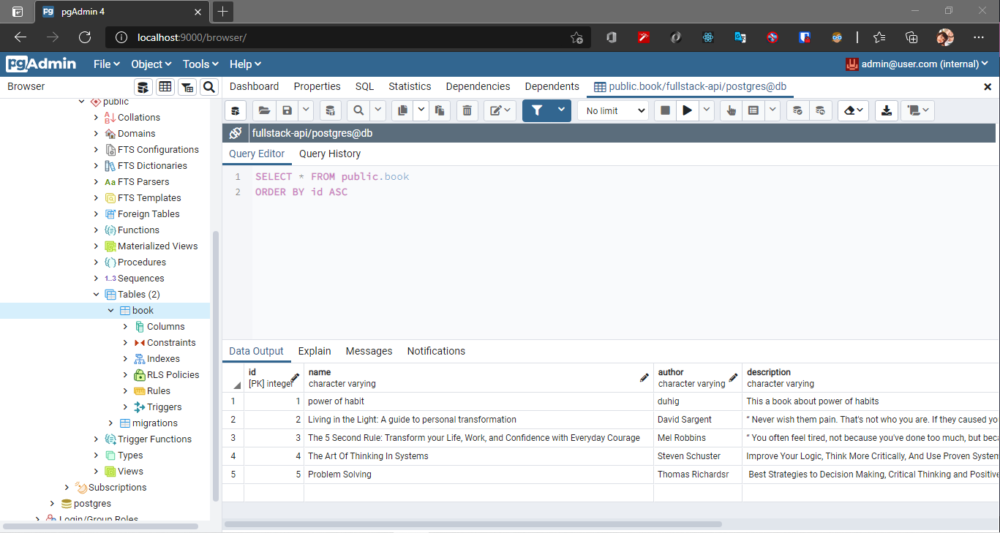

# Fullstack-Challenge API

## This API had made with:

- Typescript
- Docker
- PostgreSQL

## To run you need to have installed **Docker** and **Docker Compose** on WSL or some Linux Distro

On folder **backend** run:

```
sudo docker-compose up build
```

## ScreenShots



