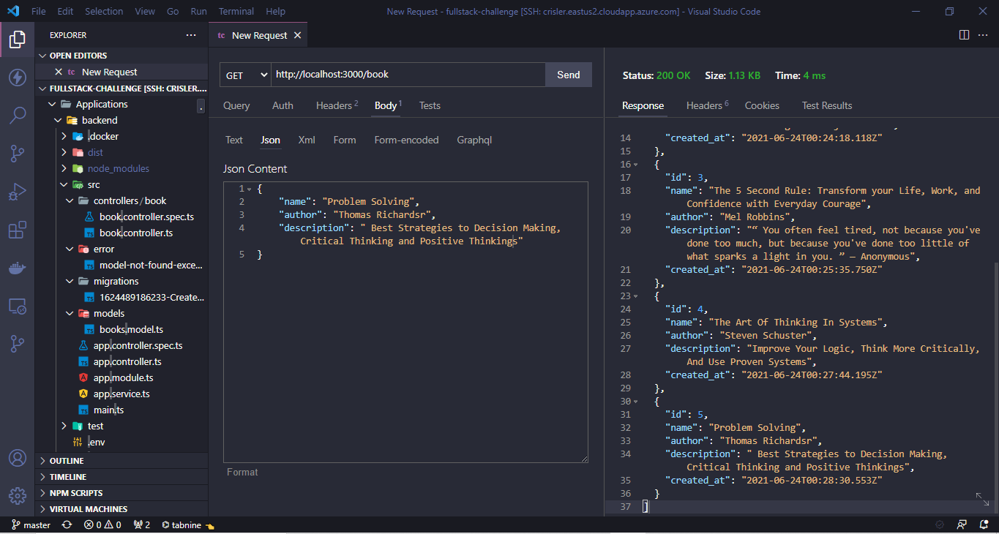

# Fullstack-Challenge API

## This API was made with:

- NestJS
- Typescript
- Docker
- PostgreSQL
- PGAdmin4

## To run you need to have installed the **Docker** Runtime' and **Docker Compose** on WSL or some Linux Distro

On folder **backend** run:

```
sudo docker-compose up build
```

## ScreenShots



